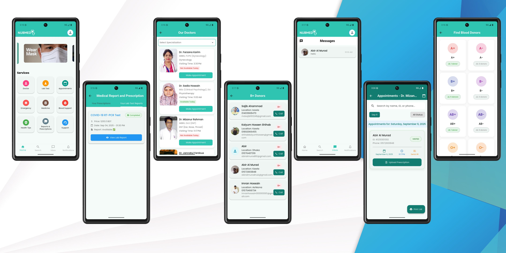

# NUBMED - University Hospital Management System

NUBMED is a **Flutter-based Hospital Management System** designed for university hospitals. It helps manage patients, doctors, medical records, and notifications efficiently. The project integrates **Firebase** for authentication, data storage, and push notifications.

---

## 📱 Download App Now

[](https://drive.google.com/uc?export=download&id=1XxcFlNhEtKcdfh54sbx26gWe2LzfXlUe)

**Latest Version:** v1.1.2 | **Size:** ~61MB | **Updated:** December 2025

### System Requirements:
- Android 8.0 (API level 26) or higher
- 150MB free storage space
- Internet connection for authentication and data sync
- RAM: 2GB minimum, 4GB recommended

---

## 🏥 Features

### **👤 User Features**
- **📧 Email Authentication:** Secure email-based registration and login with email verification
- **👤 Profile Management:** Users can manage personal info including contact and blood group
- **🔔 Notifications:** Users receive push notifications for reports, updates, and alerts
- **📋 Report Management:** Upload and view lab reports
- **🩸 Blood Request System:** Request blood and get notifications for matching donors with direct calling feature
- **📅 Appointment Booking:** Schedule appointments with doctors
- **💊 Prescription Access:** View digital prescriptions from doctors

### **🩸 Blood Donor Features**
- **📞 Direct Contact:** Donors receive calls directly from blood requesters
- **📍 Location Sharing:** View donor's location and contact details
- **📧 Email & Phone:** Access to donor's email and phone number for emergency contact

### **👨‍⚕️ Doctor Features**
- **🏥 Patient Management:** View and manage patient appointments
- **📝 Prescription Writing:** Create and send digital prescriptions
- **🔬 Lab Test Management:** Order and view lab test results
- **⏰ Schedule Management:** Set and manage availability

### **⚙️ Admin Features**
- **👨‍⚕️ Doctor Management:** Add, edit, and delete doctor profiles
- **💊 Medicine Management:** Add new medicines and manage inventory
- **💡 Health Tips Management:** Create, update, or delete health tips content
- **📊 Report Tracking:** Monitor uploaded reports for all patients
- **👥 User Management:** Manage all system users and permissions

### **🛠️ Technical Features**
- Built with **Flutter** for cross-platform support (Android & iOS)
- **Firebase Email Authentication** with email verification
- **Cloud Firestore** for scalable database storage
- **ImgBB Integration** for image uploads
- **Push Notifications** for real-time updates
- **Image Picker & Storage**: Upload images for doctor profiles and reports
- **📄 PDF Generation**: Create and share medical reports and prescriptions
- **📞 Direct Calling**: Integrated calling system for blood requests

---

## 🚀 Installation Options

### **Option 1: Direct APK Download (Recommended)**

1. **📱 Download the APK**
   - Click the download button above
   - File will download automatically from Google Drive (~61MB)

2. **📲 Install the App**
   - Open the downloaded APK file
   - Allow installation from unknown sources when prompted
   - Complete the installation process

3. **✅ Email Verification**
   - Create your account with email
   - Check your email (including spam folder) for verification link
   - Click the verification link to activate your account

4. **🎯 Get Started**
   - Sign in with your verified email
   - Start managing your healthcare!

### **Option 2: Build from Source Code**

#### **Prerequisites:**
- Flutter SDK (>=3.0.0)
- FVM (Flutter Version Management) installed
- Git
- Android Studio / VS Code

#### **Development Setup:**

1. **📂 Clone the repository**
   ```bash
   git clone https://github.com/Abir-Al-Murad/NUBMED-Hospital-Management-System-.git
   ```

2. **📁 Navigate to project directory**
   ```bash
   cd NUBMED
   ```

3. **🔧 Set Flutter version using FVM**
   ```bash
   fvm use 3.32.8
   ```

4. **📦 Install dependencies**
   ```bash
   fvm flutter pub get
   ```

5. **▶️ Run the app**
   ```bash
   fvm flutter run
   ```

### **🔥 Firebase Setup (For Developers)**

1. Create a new Firebase project at [Firebase Console](https://console.firebase.google.com/)
2. Enable **Email Authentication** only
3. Configure email verification settings
4. Set up Cloud Firestore database
5. Add your `google-services.json` to `android/app/`
6. Configure Firebase Cloud Messaging for notifications

---

## 📁 Project Structure

```
lib/
├── models/           # Data models (User, Doctor, Appointment, etc.)
├── pages/            # App screens and pages
├── services/         # Firebase and API services
├── utils/            # Utilities and helpers
├── widgets/          # Reusable UI components
└── main.dart         # Application entry point
```

---

## 🚀 Key Functionalities

### **📧 Authentication System**
- Email-based registration and login
- Email verification (check spam folder)
- Secure password management
- Session persistence

### **🏥 Hospital Management**
- Doctor appointment scheduling
- Patient record management
- Lab test ordering and results
- Prescription management

### **🩸 Advanced Blood Request System**
- **📞 Direct Calling:** Call donors directly from the app
- **📍 Location Access:** View donor's location for emergency pickup
- **📧 Contact Details:** Access to donor's email and phone number
- **🔔 Real-time Notifications:** Instant alerts for blood requests

### **💊 Medicine Inventory**
- Stock management
- Low stock alerts
- Price tracking
- Expiry date monitoring

---

## 🎯 Upcoming Features

- 💻 **Telemedicine integration**
- 🤖 **AI-powered symptom checker**
- ⌚ **Wearable device integration**
- 🌍 **Multi-language support**
- 📱 **Offline functionality**
- 💳 **Payment gateway integration**
- 🏥 **EHR system compatibility**
- 📊 **Analytics Dashboard**

---

## 📊 Technology Stack

- **Frontend:** Flutter SDK (managed with FVM)
- **Backend:** Firebase (Email Auth, Firestore, Storage)
- **Image Processing:** Image Picker, ImgBB
- **Notifications:** Firebase Cloud Messaging
- **PDF Generation:** Printing package
- **Database:** Cloud Firestore
- **Authentication:** Firebase Email Authentication
- **Calling:** URL Launcher for direct calling

---

## 📧 Email Verification Notice

⚠️ **Important:** After signing up, please check your **email spam folder** for the verification link. The verification email might be filtered as spam by some email providers.

---

## 📱 Screenshots



---

## 🤝 Contributing

We welcome contributions! Please feel free to submit pull requests or open issues for bugs and feature requests.

### **Development Setup:**
1. Fork the repository
2. Install FVM and set Flutter version: `fvm use 3.32.8`
3. Create your feature branch (`git checkout -b feature/AmazingFeature`)
4. Commit your changes (`git commit -m 'Add some AmazingFeature'`)
5. Push to the branch (`git push origin feature/AmazingFeature`)
6. Open a Pull Request

---
## 🙌 Credits

- Abir Al Murad  
- Md. Maruf Sheikh  
- Md. Pial Hossain
  
---

## 📞 For Support, Bug Reports, or Feature Requests

- 📧 **Email:**
  - [abiralmuradnub@gmail.com](mailto:abiralmuradnub@gmail.com)  
  - [pial.nub.ac@gmail.com](mailto:pial.nub.ac@gmail.com)  
  - [mdmarufsheikh707@gmail.com](mailto:mdmarufsheikh707@gmail.com)

- 🐛 **GitHub Issues:**  
  [Create an issue](https://github.com/Abir-Al-Murad/NUBMED-Hospital-Management-System-/issues)

- 💬 **Discord:**  
  Join our community *(Link coming soon)*


---

## 🔧 Troubleshooting

### **Common Issues:**

1. **Email verification not received?**
   - Check spam/junk folder
   - Wait 5-10 minutes for email delivery
   - Request new verification link

2. **App installation blocked?**
   - Enable "Install from unknown sources" in Android settings
   - Ensure you have enough storage space (150MB+)

3. **Build issues with FVM?**
   - Make sure FVM is properly installed
   - Use the correct Flutter version: `fvm use 3.32.8`
   - Clear pub cache: `fvm flutter pub cache clean`

---

## 📄 License

This project is licensed under the **MIT License** - see the [LICENSE.md](LICENSE.md) file for details.

---

## 🙏 Acknowledgments

- **Flutter team** for the amazing framework
- **Firebase team** for backend services
- **Open-source community** for various packages
- **NUB community** for testing and feedback
- **FVM team** for Flutter version management

---

## ⭐ Show Your Support

If you find this project useful, please consider giving it a star!

[](https://github.com/Abir-Al-Murad/NUBMED-Hospital-Management-System-/stargazers)

---

## 📈 Project Stats


---

**Last Updated:** September 2025 | **Version:** 1.1.2


